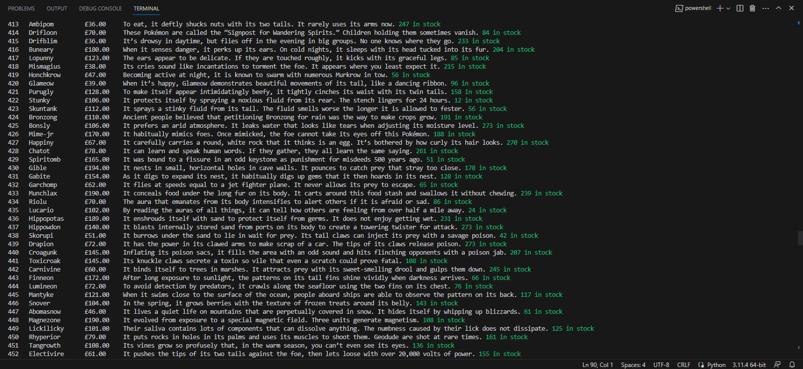
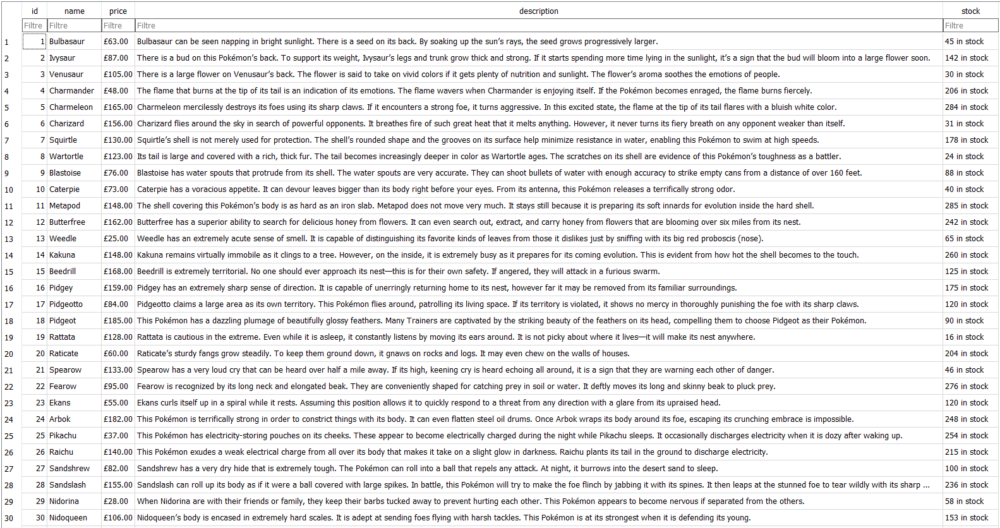
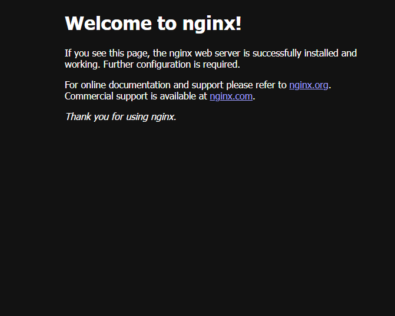
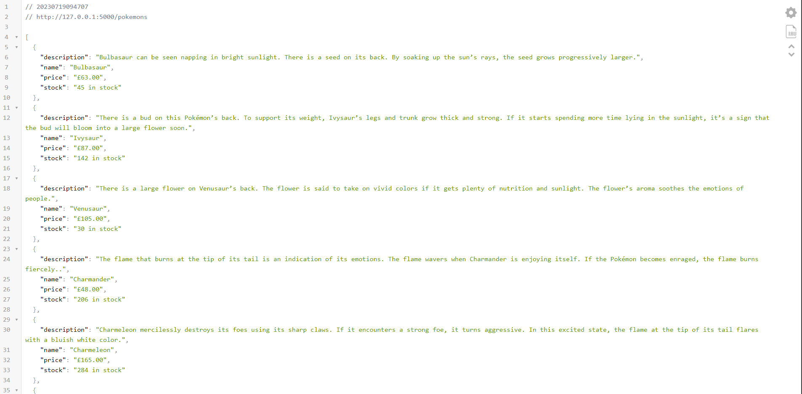
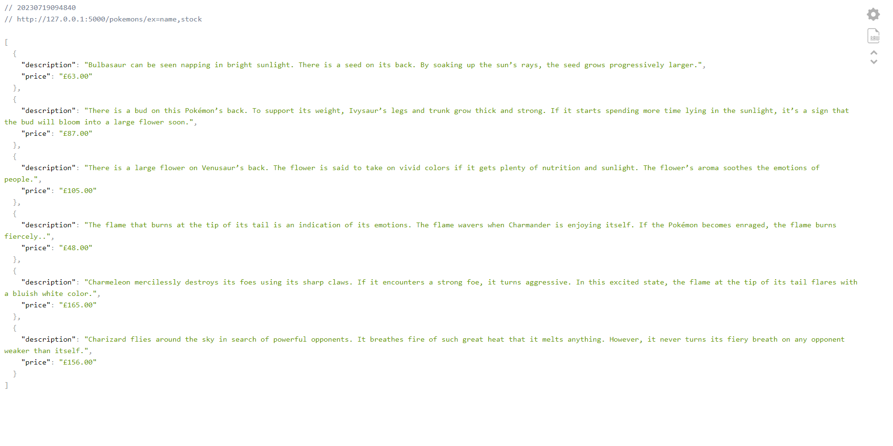
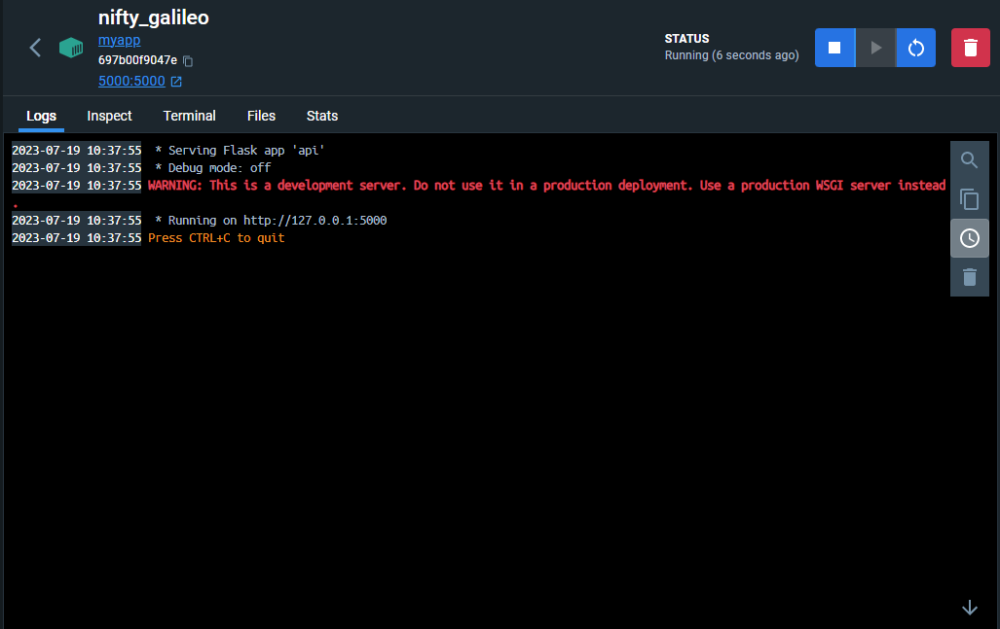

# Pokemon API Projesi
Bu proje, [scrapeme.live/shop](scrapeme.live/shop) sitesinden tüm ürün verilerini çeken bir programın geliştirilmesini ve bu verilerin bir veritabanına kaydedilmesini içermektedir. Ardından Python kullanılarak bir REST API servisi oluşturuldu.
Proje, yazılım tasarım prensiplerine ve SOLID prensiplerine uygun olarak tasarlandı ve kod akışı bu prensiplere göre yapılandırıldı.Ayrıca, servisin yapılandırma dosyasıyla yönetilebilir olması sağlandı son olarak servisin hangi port üzerinde çalıştığı client tarafından bilinmemesi için [NGINX]( https://www.nginx.com/) kullanıldı.

# Adım 1: Veri Çekme ve Veritabanına Kaydetme
1.1 Veri Çekme
[scrapeme.live/shop](scrapeme.live/shop) sitesinden Python kullanarak tüm ürün verilerini çeken bir program yazıldı.

1.2 Veritabanına Kaydetme
Çekilen veriler "name", "price", "description" ve "stock" olmak üzere dört sütundan oluşan bir tabloya bir veritabanında kaydedilecektir.
Bunun için [DB Browser for SQLite](https://sqlitebrowser.org) kullanabilirsiniz.

# Adım 2: REST API Servisi
Python kullanılarak bir REST API servisi yazıldı. 
Servis tasarımında yazılım prensiplerine dikkat edildi ve kod akışı bu prensiplere uygun olarak yapılandırıldı.
[NGINX]( https://www.nginx.com/) kurulumu yaptıktan sonra "nginx.conf" dosyasında port gizleme ayarı yapılarak servisin hangi port üzerinde çalıştığı client tarafından bilinmemesi sağlanmıştır.
NGINX kurulumunun tamamlandığını, kullandığınız web tarayıcıdan "localhost" a giderek aşağıdaki gibi bir ekran gördüğünüzde anlayabilirsiniz.

# Adım 3: Endpointler ve Veri Çıktıları
3.1 Endpointler
GET /pokemons: Tüm Pokemon verilerini içeren bir JSON çıktısı döndürür.

GET /pokemons/ex=<excluded_fields>: Verilen sütun isimlerini çıktıda göstermeyen bir JSON çıktısı döndürür.

3.2 Veri Çıktıları
Endpointlerin döndürdüğü JSON çıktıları, istenen sütunlarla birlikte uygun şekilde düzenlenmiş şekilde gösterilecektir.

# Adım 4: Dockerize Etme
Tüm süreç tamamlandıktan sonra proje Docker konteynerine taşınır.

 

 
